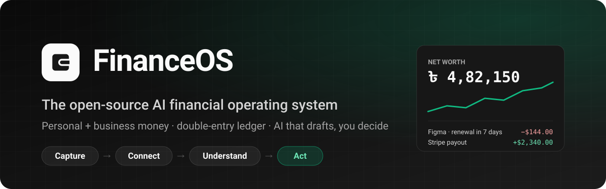
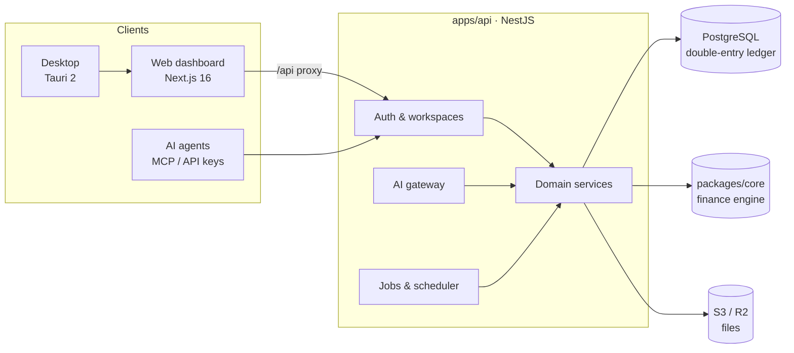

<div align="center">



# FinanceOS

**The open-source, self-hostable AI finance app for people *and* businesses.**
Track expenses, income, subscriptions, projects, payroll, investments and net worth in one double-entry ledger —
with AI that reads your receipts and answers your questions, but never touches the books without your say.

[](./LICENSE)
[](https://github.com/shimentosh/financeos/actions/workflows/ci.yml)
[](#tech-stack)
[](#tech-stack)
[](#tech-stack)
[](#tech-stack)
[](#self-hosting)
[](./CONTRIBUTING.md)

[Features](#features) · [Why FinanceOS](#why-financeos) · [Quick start](#quick-start) · [AI providers](#bring-your-own-ai) · [Self-hosting](#self-hosting) · [Architecture](#architecture) · [Contributing](#contributing)

⭐ **If FinanceOS is useful to you, star the repo** — it helps other people find it.

</div>

---

## Why FinanceOS

Most money apps make you choose: a **personal budgeting app** that can't handle a side business, or **accounting software** that's overkill for your own life. Freelancers, founders, small agencies and families live in both worlds at once — salary *and* client payments, Netflix *and* AWS, a car loan *and* an SME loan.

Meanwhile, "AI finance" tools tend to let a language model *become* the record: numbers you can't trace, categories that silently change, totals nobody can audit.

FinanceOS takes the opposite stance:

> **The ledger is the source of truth. AI extracts, classifies, suggests and explains — but every AI output is a draft until a person (or a rule you wrote) confirms it.**

That gives you:

- 🧾 **Numbers you can trust** — a real double-entry ledger, integer money, original currency kept forever, an audit trail on every change.
- 🔍 **Every number is clickable** — net worth, burn, budget, forecast: each one links to the transactions behind it.
- 🤖 **AI that saves time, not accuracy** — snap a receipt, type *"lunch 450 bkash"* in Bangla or English, or ask *"how much did we spend on AI tools this quarter?"* — and review before anything posts.
- 🏠 **Your data, your server** — self-host with Docker, run local models through Ollama, keep everything private. No vendor lock-in, no selling your data.
- 🌍 **Built for real-world money** — multi-currency with FX tracking, and first-class support for mobile wallets like **bKash, Nagad and Rocket** alongside banks, cards, Wise, Payoneer and Stripe.

```
Capture → Connect → Understand → Act
```

## Features

| | |
|---|---|
| 💸 **Money** | Accounts (banks, bKash/Nagad/Rocket, cards, cash, Wise, Payoneer, Stripe, digital currency), every transaction type (expense, income, transfer, refund, adjustment, investment, asset purchase, debt payment, loan, owner equity), multi-currency with original/account/base amounts and the FX rate used, reconciliation |
| 🔁 **Subscriptions & bills** | Subscription tracker with renewal history and **price-change detection**, rent/salary/loan/insurance/tax schedules, a payment calendar, "mark as paid" with duplicate protection, reminders at 30/14/7/3/1/0 days |
| 🏢 **Business** | Projects with revenue, cost by group, burn rate, budget use, runway and capital invested; revenue analytics; **payroll** paid month by month with proof |
| 📈 **Wealth** | Assets with valuations, investments (realised/unrealised gains, ROI), liabilities and payables, receivables with ageing, **net worth** history with explicit completeness warnings |
| 🎯 **Goals** | Savings goals, dream purchases, savings plans with the required monthly contribution |
| 🤖 **AI** | Receipt / screenshot / PDF extraction with per-field confidence, Bangla + English natural-language entry, voice entry, subscription & duplicate detection, recurring-charge and anomaly detection with evidence, an **AI Inbox** for decisions, and a **Copilot** that answers only from your data |
| 🔌 **Integrations** | Provider-neutral connector framework: Stripe, a custom REST connector for your own apps, signed inbound webhooks, CSV/Excel import with column mapping and preview, sync history, API keys, a public API and an **MCP server** so other AI agents can use your books safely |
| 📊 **Reports** | Summary, cash-flow statement, 30/60/90-day **cash-flow forecast**, weekly/monthly/quarterly reports whose narratives only restate computed figures |
| 👥 **Teams** | Personal and business workspaces, email invitations, owner/admin/member/viewer roles, two-factor authentication |
| 🛠️ **Admin** | Platform panel: users, workspaces, job queue and schedules, AI spend and credits, storage (S3 / Cloudflare R2), integration health, audit log |
| 🖥️ **Desktop** | A Windows app (Tauri 2, MSI installer) that wraps your FinanceOS server in a native window |

## Who is it for?

- **Freelancers & solo founders** who mix personal and business money and want both views without two apps.
- **Small agencies & startups** tracking project profitability, burn, runway, payroll and SaaS spend.
- **Families & individuals** who want budgets, subscriptions, goals and net worth in one honest place.
- **Developers & self-hosters** who want a hackable, privacy-respecting alternative to closed SaaS finance apps.
- **Teams in South Asia** who need mobile-wallet accounts (bKash, Nagad, Rocket), BDT, and Bangla input to just work.

## Quick start

**Requirements:** Node 24+, pnpm 10, Docker.

```bash
git clone https://github.com/shimentosh/financeos.git
cd financeos
pnpm install

cp .env.example .env            # then set BETTER_AUTH_SECRET and ENCRYPTION_KEY:
                                #   openssl rand -base64 32   (once for each)
pnpm db:up                      # PostgreSQL on :5436
pnpm db:migrate
pnpm db:seed                    # optional: a realistic demo user with a year of data
pnpm dev                        # web → http://localhost:3100 · API → http://localhost:4100/api
```

In development the first account you create becomes the platform admin; in production only the emails in `ADMIN_EMAILS` do.

### Demo data

`pnpm db:seed` signs up **demo@financeos.app** / **demo-financeos** (override with `SEED_EMAIL`, `SEED_PASSWORD`) and creates a year of activity through the real services:

- **Personal workspace** — salary and freelance income, bKash/Nagad/card/cash spending, subscriptions with renewal history and a real price change, rent and school fees, budgets, assets, investments with monthly valuations, a car loan, money lent and borrowed, and goals.
- **Business workspace "Shimanto Labs"** — Stripe and Payoneer revenue, three projects, payroll, AI and hosting costs, an annual Figma renewal, invoices, a payable and an SME loan.

The daily checks then fill the AI Inbox. `pnpm db:seed --reset` replaces only the demo account and the workspaces it owns.

## Bring your own AI

Pick the provider in the app under **Admin → AI**: paste a key, choose a model, press **Test connection**, save. Keys are stored encrypted (AES-256-GCM) and never shown again.

| Hosted | Local / self-run |
|---|---|
| Anthropic Claude · OpenAI · Google Gemini · DeepSeek · OpenRouter · Groq · Mistral · xAI Grok · Qwen · Kimi · Together AI | **Ollama** · **LM Studio** · any **OpenAI-compatible** endpoint (vLLM, LiteLLM, Azure, a company gateway) |

Models that can't read images (e.g. DeepSeek) can be paired with a separate **image model** for receipts, screenshots and PDFs. Every call is metered, with a monthly budget per workspace; built-in prices keep budgets accurate.

**No AI key? It still works.** Text and voice entries use the built-in Bangla/English parser, rules and merchant memory categorise known merchants, screenshots are attached for manual review, and the Copilot answers from its built-in reading of the question. A refusal, error or exhausted budget always falls back to this deterministic path.

**How the Copilot stays honest:** it reads the ledger only through a fixed set of read-only, workspace-scoped queries. The figures beside every answer come from those queries — each linked to its records — never from the model's text. Writes are proposals that a member confirms before they touch the books.

## Self-hosting

Two Docker images (`apps/api/Dockerfile` for the API, worker and migrations; `apps/web/Dockerfile` for the Next.js standalone server) and a one-server stack:

```bash
cp .env.example .env            # production values: APP_URL, secrets, POSTGRES_PASSWORD, DATABASE_URL, ADMIN_EMAILS
docker compose -f compose.prod.yml up -d --build   # postgres → migrate → api + worker → web on 127.0.0.1:3100
```

Put a TLS reverse proxy in front of the web container. Health checks: `GET /api/health` (liveness) and `GET /api/health/ready` (database reachable, no pending migrations).

- 📘 [docs/deploy.md](./docs/deploy.md) — environment, managed PostgreSQL, backups and restore drills, R2/S3 storage, email (SPF/DKIM), payment webhooks, scaling, upgrades, key rotation, monitoring.
- 🚀 [docs/dokploy.md](./docs/dokploy.md) — deploying on Dokploy.

**Storage:** `STORAGE_DRIVER=local` or any S3-compatible store (AWS S3, Cloudflare R2, MinIO). PostgreSQL holds only metadata; files are served only to members of their workspace.

**Background work:** the API runs the worker in-process by default. To scale out set `RUN_WORKER_IN_PROCESS=false` and run `pnpm worker` — any number of workers share the PostgreSQL queue, and each scheduled task runs once per slot. Hosts without long-running processes can call `POST /api/system/tick` with `x-cron-secret`.

### Desktop app (Windows MSI)

`apps/desktop` is a Tauri 2 shell around the web app; the ledger, API and database stay on the server. Use **File → Change server…** to point it at any FinanceOS instance.

```bash
pnpm desktop:dev                # run the shell against your running server
pnpm desktop:build              # → apps/desktop/src-tauri/target/release/bundle/msi/*.msi
FINANCEOS_SERVER_URL=https://books.example.com pnpm desktop:build   # bake in a default server
```

Requires Rust (MSVC toolchain) and WebView2. The server's `APP_URL` must match the address the desktop app connects to.

## Architecture



```
packages/core   Pure TypeScript finance engine and shared Zod contracts. No IO.
                Money/dates, ledger entries, P&L and cash-flow statements, schedules,
                subscriptions, budgets, net worth, investments, forecasting, duplicate
                and recurring detection, anomalies, rules, the Bangla/English parser.
apps/api        NestJS 12 (ESM, SWC) · Drizzle + PostgreSQL · Better Auth
apps/web        Next.js 16 App Router · React 19 · Tailwind v4 · Base UI
apps/desktop    Tauri 2 shell (Windows MSI)
```

**Design principles**

- **Money is integer minor units**; financial dates are `YYYY-MM-DD` days. No floats in arithmetic, ever.
- Every transaction keeps its original amount and currency, the account-currency amount, the base-currency amount and the FX rate used.
- Posted transactions produce signed **double-entry** lines; balances, cash flow and net worth read those lines. Transfers, investments, loans and equity never count as income or expense.
- Every workspace-scoped request resolves the workspace from the session and a verified membership; every query filters by it, and every id a request supplies is checked to belong to it.
- Every financial mutation writes a before/after **audit record** in the same database transaction.
- Long work runs on a PostgreSQL job queue (`FOR UPDATE SKIP LOCKED`) with a transactional outbox for domain events.
- Integration secrets are encrypted with AES-256-GCM and never returned by the API.

### Tech stack

TypeScript · Next.js 16 · React 19 · Tailwind CSS v4 · Base UI · NestJS 12 · Drizzle ORM · PostgreSQL · Better Auth · Zod · Vitest · Biome · Tauri 2 · Docker

## Development

```bash
pnpm dev | build | start | worker
pnpm typecheck                  # all packages
pnpm test                       # core unit + API unit/integration (needs DATABASE_URL_TEST)
pnpm lint
pnpm db:generate | db:migrate | db:seed
```

CI lints, typechecks, runs every test suite against PostgreSQL and builds both Docker images. Engineering conventions — money rules, workspace isolation, how the Copilot reads and writes — are in [AGENTS.md](./AGENTS.md).

## FAQ

<details>
<summary><b>Is FinanceOS free?</b></summary>

Yes. FinanceOS is free and open source under the AGPL-3.0. Self-host it on your own server at no cost; with billing turned off (the default for self-hosting) every feature is available.
</details>

<details>
<summary><b>Is my financial data private?</b></summary>

When you self-host, your data never leaves your infrastructure. You choose the AI provider — or run a local model with Ollama or LM Studio so nothing is sent to a third party. Credentials are encrypted at rest and never returned by the API.
</details>

<details>
<summary><b>Can I use it without AI?</b></summary>

Yes. The ledger, budgets, subscriptions, reports, forecasts and the Bangla/English quick-entry parser all work without any AI key.
</details>

<details>
<summary><b>How is this different from a budgeting app or from accounting software?</b></summary>

Budgeting apps usually stop at categories and can't model projects, payroll, receivables or equity. Accounting software is built for accountants and rarely covers personal goals, subscriptions or net worth. FinanceOS runs one double-entry ledger underneath both, with separate personal and business workspaces on top.
</details>

<details>
<summary><b>Does it support bKash, Nagad and Bangladeshi Taka?</b></summary>

Yes — mobile-wallet accounts, BDT and Bangla natural-language input are first-class, alongside any other currency.
</details>

## Contributing

Contributions of every size are welcome — bug reports, docs, translations, new bank or wallet connectors, and features.

1. Read [CONTRIBUTING.md](./CONTRIBUTING.md) and [AGENTS.md](./AGENTS.md).
2. Open an [issue](https://github.com/shimentosh/financeos/issues) to discuss bigger changes first.
3. Send a pull request with tests.

Found a security issue? Please follow [SECURITY.md](./SECURITY.md) instead of opening a public issue.

## License

FinanceOS is licensed under the [GNU Affero General Public License v3.0](./LICENSE). You can use, modify and self-host it freely; if you run a modified version as a network service, you must share your changes under the same license.

<div align="center">

---

Made with care by [@shimentosh](https://github.com/shimentosh) · If FinanceOS helps you, **give it a ⭐**

<sub>Keywords: open-source finance app · self-hosted budgeting · expense tracker · personal finance manager · small business accounting · AI receipt scanner · subscription tracker · net worth tracker · cash-flow forecast · double-entry ledger · bKash · Nagad · Bangla finance app</sub>

</div>
